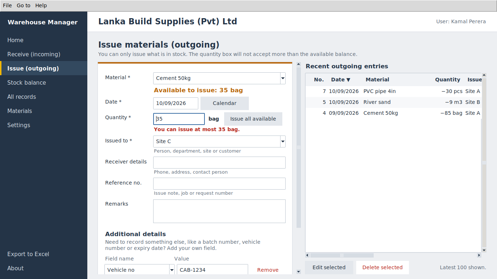

# Warehouse Manager

A simple Windows program for recording materials coming into and going out of a warehouse,
and for checking the stock balance at any time. Built with Python and Tkinter.

Developed by **Shanaka Ramesh**, Infinite_engineering solution.



---

## Quick start (Python already installed)

1. Unzip the project folder anywhere, e.g. `C:\WarehouseManager`.
2. Double-click **`runner.bat`**.
3. Choose **4** to install the Excel library (only needed once).
4. Choose **2** to check the system. Everything should show `[ OK ]`.
5. Choose **1** to start the program. On first start, enter your company name and your name.

Tip: option **8** creates a desktop shortcut, so staff can start the program with one
double-click without seeing the menu.

### runner.bat menu

| Option | What it does |
|---|---|
| 1 Start Warehouse Manager | Quick checks, then opens the program |
| 2 Check system | Python version, Tkinter, screen size, Excel library, program files, data folder, free disk space, backups, database health, negative-balance check, Excel export |
| 3 Self-test | Tests every stock rule on a temporary database. Your real data is never touched |
| 4 Install / update libraries | Installs `openpyxl` (works without administrator rights) |
| 5 Developer tests | Runs the full `pytest` suite |
| 6 Build Windows program | Creates `dist\WarehouseManager\WarehouseManager.exe` |
| 7 Open data folder | Opens the folder holding your database and backups |
| 8 Create desktop shortcut | Adds a "Warehouse Manager" icon to the desktop |

The same actions work from a command prompt: `runner.bat check`, `runner.bat selftest`,
`runner.bat start`, and so on. Or directly with Python:

```
python run.py              check essentials, then start
python run.py --check      full system check
python run.py --selftest   stock-rule self-test
python run.py --install    install libraries
python run.py --test       developer tests
python run.py --build      build the .exe
```

**If Python is not found:** install Python 3.9 or newer from python.org and tick
**"Add python.exe to PATH"**. Keep **"tcl/tk and IDLE"** ticked; that is Tkinter.

---

## Using the program

| I want to...                        | Go to                  |
|-------------------------------------|------------------------|
| Record materials that arrived       | **Receive (incoming)** |
| Record materials that were issued   | **Issue (outgoing)**   |
| See how much of everything I have   | **Stock balance**      |
| Find, correct or delete an entry    | **All records**        |
| Get everything in Excel             | **Export to Excel**    |

Each entry records the material, date, quantity, supplier (or who it was issued to), their
details, a reference number and remarks. Under **Additional details** you can add your own
fields, such as *Batch no*, *Vehicle no* or *Expiry date*.

**Stock can never go below zero.** When issuing, the program shows how much is available and
the quantity box refuses any number above it, with a message saying the maximum. "Issue all
available" fills in the full amount. The program also stops you from deleting or reducing an
incoming entry if that stock has already been issued.

Typing a new material name on the Receive screen adds it to your material list. Set a
**low-stock warning** level on a material and the Stock balance screen highlights it in yellow.

Keyboard shortcuts: `Ctrl+I` receive, `Ctrl+O` issue, `Ctrl+B` balance, `Ctrl+R` records,
`Ctrl+E` export, `Ctrl+H` home.

### Your data
Stored in one file: `C:\Users\<you>\AppData\Roaming\WarehouseManager\warehouse.db`

- A backup is made automatically every day the program is opened (the last 30 are kept).
- **Settings → Save a backup copy** puts a copy on a USB drive or cloud folder.
- Removing the program folder or uninstalling does **not** delete your data.
- To restore: close the program, then copy a backup file over `warehouse.db`.

---

## Installer for other PCs (GitHub Actions)

**Step-by-step setup guide: [docs/GITHUB_SETUP.md](docs/GITHUB_SETUP.md)**

Each build produces three files. None of them need Python on the client's PC:
`WarehouseManager-Setup-<version>.exe` (installer), `WarehouseManager-<version>.exe`
(single file, runs without installing) and `WarehouseManager-Portable-<version>.zip`.

`.github/workflows/build-windows.yml` runs on every push and pull request:

1. Runs all tests on Linux under a virtual display.
2. On a Windows runner: runs `runner.bat selftest` and `runner.bat check` (so the batch file
   itself is tested on real Windows), runs all tests, builds the `.exe` with PyInstaller,
   starts the `.exe` to confirm it doesn't crash, builds the installer with Inno Setup,
   makes a portable zip, and builds and start-tests the single-file `.exe`.
3. Uploads the installer and zip as downloadable artifacts.

**To publish a release**, push a version tag:
```
git tag v1.1.0
git push origin v1.1.0
```
The version is stamped into the program (About window and the exe's file properties) and a
GitHub Release is created with `WarehouseManager-Setup-1.1.0.exe` and the portable zip.
PCs that install from the `Setup.exe` do not need Python.

If Windows shows *"Windows protected your PC"* for the installer, click **More info → Run
anyway**. This appears because the program is not code-signed yet (see docs/DESIGN.md).

---

## Project layout
```
runner.bat                   Windows menu: start, check, self-test, install, build, shortcut
run.py                       system checker, self-test, launcher, build helper
main.py                      program entry point (theme, error handler, first-run, daily backup)
app/version.py               name, version, developer (CI rewrites the version)
app/database.py              SQLite schema and ALL business rules (stock can't go negative)
app/export.py                Excel export
app/ui/                      Tkinter screens and widgets (date picker, sortable tables...)
tests/                       pytest suite (business rules + UI)
WarehouseManager.spec        PyInstaller recipe (folder build, used by the installer)
WarehouseManager-onefile.spec  PyInstaller recipe (single-file exe)
installer/                   Inno Setup script + exe version-info generator
docs/DESIGN.md               architecture, data model, rules and roadmap
```
